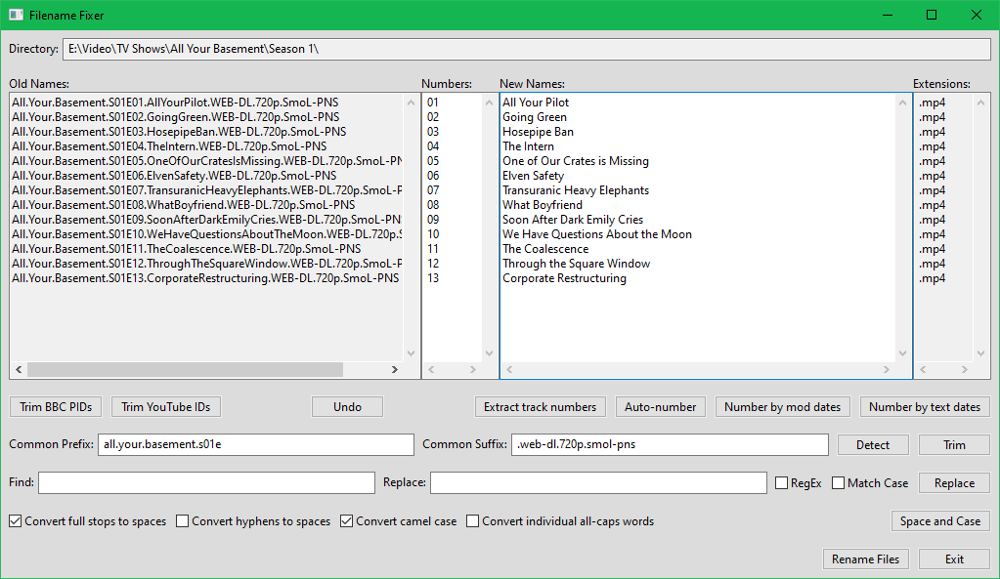

# Filename Fixer

I finally got tired of manually renaming various collections of legitimately-acquired media files, and created this tool to semi-automate the process. Also it gave me a chance to play with writing GUI apps in Python.

## How to Use

If you have [Python](https://www.python.org/) and [wxPython](https://www.wxpython.org/) installed, you should be able to run `fixer.pyw` in the usual fashion.

- Drag and drop some files into the Filename Fixer window.
- Use any combination of button-pushing, pasting, and manual editing to fix the names.
- Hit *Rename Files*.
- If any files are left in the list, they didn't get renamed. This could be due to duplicated names, the user lacking write privileges, or something else, sorry!

## Known Issues

I've only tested this in Windows so far, I have no idea whether it works in anything else.

Removing BBC or YouTube IDs requires them to have been appended to filenames in the default formats used by get_iplayer and youtube-dl.

The undo stack is only added to when pressing a command button.

The space-and-case algorithm works in most cases, but sometimes gets it wrong.

The interface is a bit haphazard because I added stuff as I needed it, and probably a bit confusing to anyone who isn't me.

I need to find out how to make the textboxes scroll in sync (no spoilers, please!), and do so.

This was written to scratch a personal itch, and to try out wxPython, so the usual caveats about code quality apply 😅

## License

Code is copyright by Tyrone C. and made available under the MIT license, the text of which can be found in the `LICENSE.md` file in this repository.
